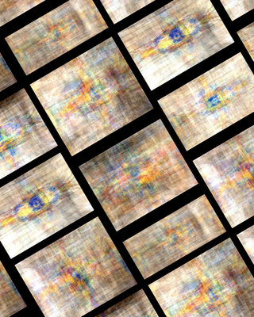

</script>

[繁體中文](./index.html) | [English](./index-en.html)

### 你是不是也在心裡問過這些問題，卻一直找不到答案？

你其實已經很努力了。
只是，有些卡住的地方，不是靠忍耐、努力或理性思考就能解開的。

你可能正經歷這些狀態之一——

**▍關係裡的無力感**
你和另一半常常為小事爭吵，彼此都覺得對方不理解自己。
你知道問題不只是錢、不只是個性、不只是生活壓力，
卻怎麼也說不清楚「到底卡在哪裡」。
想離開，又捨不得；留下，又覺得好痛苦。
你一個人承受，卻不知道該向誰求助。

**▍親子之間越來越遠**
孩子不想唸書、沒有動力，你著急、心疼、卻又無力。
你開始懷念以前那個黏著你的孩子，
卻不知道從什麼時候開始，你們之間像隔了一層牆。
你想幫他，但不知道真正的問題在哪裡。

**▍關係裡的孤單感**
明明有伴侶，卻像一個人在撐整個家。
一個在外賺錢，一個在裡面承擔情緒與照顧，
你們沒有吵架，卻也沒有真正靠近。

**▍孩子在人際中的困難**
孩子說在學校沒有朋友、被排擠、不被理解。
你想幫，卻不知道該從哪裡開始；
老師說沒問題，但你知道孩子正在受傷。

**▍對工作的迷惘**
你對現在的工作提不起勁，卻也不知道自己適合什麼。
換工作好像很冒險，不換又覺得心在慢慢枯萎。

**▍面對新的關係，卻充滿不安**
你感覺對方有些地方怪怪的，
但說不出是哪裡不對，也不知道該不該繼續。

**▍想更認識真正的自己**
你想知道自己的優點與盲點，
為什麼別人眼中的你，和你心裡的自己不一樣。

**▍情緒低落、焦慮，卻說不出原因**
你知道自己不太對勁，
卻沒有人能真正說出「為什麼會這樣」。

**▍你想知道哪些顏色真正支持你**
不只是好不好看，而是
什麼顏色能穩定你、保護你、支持你的狀態。

**▍你想了解自己的靈性狀態**
你感覺自己不只是為了生活而活，
卻不知道目前的能量狀態卡在哪一個階段。

##### 透過氣場，我能協助你看見

* 你現在真正卡住的位置
* 關係中彼此的互動模式
* 情緒與能量為何無法流動
* 你適合的方向、節奏與修復方式

氣場早就已經在提醒你，只是沒有人替你翻譯。

### 個案回饋

##### 個案1回饋

> 能更清楚地覺察自己當下的狀態，對於個性的描述也覺得相當貼切；而子宮時期的負面經驗確實存在，因此關於讓身心達成一致的建議，讓我收穫很多。

---

##### 個案2回饋

>這次的分析就像一面鏡子，讓我重新看見自己，也更明白為何我如此熱愛大自然。它不僅帶我回顧過往，也逐漸勾勒出對未來的方向與想像。

---

##### 個案 3 回饋

>透過這次的解讀，我對自己當下的狀態有了更深一層的理解與覺察。分析中所提供的多面向觀點與建議，讓我在自我認識與調整上獲得實質的幫助，整體感受非常受用。

---

##### 個案 4 回饋（本身為療癒師）

>以療癒師的角度來看，療癒前後的氣場解讀對照相當準確，特別是在揭示個案內在深層狀態時，能協助看見那些連當事人自己都尚未意識到的創傷或記憶。
例如，在療癒過程中感受到個案臍輪存在某些非近期關係所留下的修復議題，而這些內容往往是個案尚未察覺的層面。
若以雙方皆為療癒師的角度來看，彼此能很快理解所指為何；但對於尚未接觸身心靈領域、或覺察經驗較少的個案而言，可能會較難理解其中的差異，甚至不易產生連結。

---

##### 療癒師 5 回饋（本身為療癒師，使用 Aura 解讀報告為其他個案進行療癒）

>在一開始拿到報告時，由於我並不認識該個案，因此其實不太確定該如何運用，只能先從報告中判斷哪些脈輪可能需要加強療癒，也沒有預設在過程中會有什麼樣的體驗，因為我平時的感知狀態本就較為隨性。
不過，我覺得這份報告最大的優點在於，能讓療癒師提前掌握個案可能需要加強的重點，這一點非常有幫助。
在實際療癒過程中，也確實感受到與報告內容相互呼應的狀態。
例如，在療癒上三輪時，出現一種莫名的恐懼與不適感，後來才理解這與個案對事物感受特別深刻有關；而在進行身體前側七脈輪的療癒時，也感覺到個案的能量狀態較為防禦、不易親近，彷彿在保護自己，同時又能感受到能量逐漸流動進入脈輪，這與報告中提到的防禦性與社交不安相當吻合。
在後續的對談中，也明顯感受到與個案之間的連結更加貼近。整體而言，這份報告對療癒師來說是非常有幫助的工具。

---

##### 療癒師 6 回饋（本身為療癒師，曾一家人一起進行 Aura 解讀，並將報告應用於其他個案）
>我自己一家人一起進行氣場拍攝與解讀，整體結果與家庭互動狀態的對應性非常高。
從氣場中所呈現出的每個角色之間的情緒與感受，都與實際狀況高度吻合，整體訊息呈現出強烈的共時性。
我認為，現代人越來越重視關係層面的議題，因此這樣的分析方式相當有價值。若能多進行幾次案例累積，將有助於建立更具系統性的評估流程。
在實務應用上，氣場檢測也能協助釐清療癒方向。
例如，當個案主訴頭部疼痛時，直覺上可能會著重在頭部療癒；但從氣場資訊中卻顯示，問題源自於創傷與情緒層面。實際進行療癒時，也明顯感受到下三輪特別需要靈氣支持，推測是下三輪的阻塞影響了能量往上流動，進而造成頭部不適。

---

##### 個案 7 回饋
>謝謝您提供這些內容，我覺得非常準確，也讓我更具體地看見自己目前欠缺的能力。最近面對的課題確實如您所說，我會調整自己的身心狀態，讓自己變得更加穩定與強韌。真的覺得您的解讀很準確。

---

##### 個案 8 回饋
>我是前幾天有請你幫我測過的那位，真的很準！覺得你超厲害的。

### 聯絡方式
- Line 帳號 @211wegrx
- IG 帳號 [taomuru](https://www.instagram.com/taomuru/)
- Threads 帳號 [@taomuru](https://www.threads.com/@taomuru)
- Youtube 頻道 https://www.youtube.com/@thaolaxd
- Telegram @lightaurastudio
- Email: taomuru@gmail.com
- 預約氣場諮詢 https://calendly.com/taomuru/new-meeting

### 服務方式
- 不提供健康問題諮詢,不提供過世親人通靈
- 需要提供一張全身照片, 並參考下方照片,注意人像比例跟姿勢, 頭頂上方空間佔據30%, 人佔據照片高度的20%, 腳底到最下方的空間佔據30%, 掌心向前, 背景最好是淡色的牆壁

- Google評價 https://g.page/r/CQfz6lbreLYLEBM/review

### 付款方式 (Paypal)

- [一次性氣場解讀](https://www.paypal.com/ncp/payment/5M7YTG2PM4HCL)。每次台幣 1,000元。
- [個人 Aura Reading 月訂閱](https://www.paypal.com/webapps/billing/plans/subscribe?plan_id=P-1A242348KM810422RNEURFKA) 提供每月無限次數提問，每週回覆一次。適合希望定期了解能量狀態的個人。每月台幣 1,800 元。
- [家庭 Aura Reading 月訂閱（最多 3 人）](https://www.paypal.com/webapps/billing/plans/subscribe?plan_id=P-1GT743292R9991809NEURI2I) 提供家庭成員共同使用，每月無限次數提問，每週回覆一次。適合希望了解家庭整體能量狀態的家庭。每月台幣 3,600 元。
- [朋友分享 Aura Reading 月訂閱（2 人方案）](https://www.paypal.com/webapps/billing/plans/subscribe?plan_id=P-5P259692CH450731XNEURLHQ) 提供 2 位朋友共享，每月無限次數提問，每週回覆一次。適合想一起探索能量的朋友組合。每月台幣 2,400 元。
- 付款之後，請提供您Paypal付款Email。

### 問與答
* [適合你的顏色](./colors.html), 2026-01-04