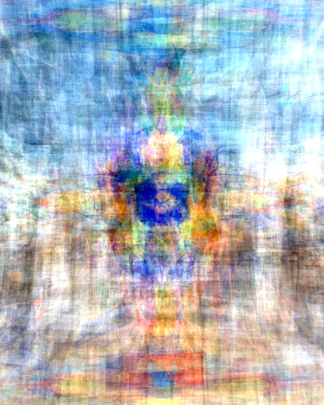

**繁體中文** | [English](./index-en.html)

# 為何你需要做氣場解讀?

氣場解讀會將你的身、心、靈完整地呈現出來，包含你知道或不知道的問題、願意或不願意面對的議題，以及你想解決卻卡住的困境。透過氣場解讀，你會得到一份清楚的「自我清單」，讓你知道該如何看見、理解並面對自己。

氣場是你的人體能量場，當中包含你的全部：
你的過去世印記、目前的狀態，以及未來的可能性。

氣場解讀是一種 **身心靈的深度分析**，協助你看到真正的問題，找到那些你一直找不到的答案。
--

## 聯絡方式
- Line 帳號 @211wegrx
- IG 帳號 [taomuru](https://www.instagram.com/taomuru/)
- Threads 帳號 [@taomuru](https://www.threads.com/@taomuru)
- Youtube 頻道 https://www.youtube.com/@thaolaxd
- Telegram @lightaurastudio
- 預約氣場諮詢 https://calendly.com/taomuru/new-meeting

## 服務方式
- 線上諮詢,可文字,語音或視訊
- 提供 Aura 基礎解讀報告一份(可指定報告的語文,例如英文,中文,等等)
- 提供一對一諮詢(額外收費)
- 不提供健康問題諮詢,不提供過世親人通靈

- 需要提供一張全身照片, 並參考下方照片,注意人像比例跟姿勢, 頭頂上方空間佔據30%, 人佔據照片高度的20%, 腳底到最下方的空間佔據30%, 掌心向前, 背景最好是淡色的牆壁, 最好是短袖短褲

- Google評價 https://g.page/r/CQfz6lbreLYLEBM/review

## 付款方式 (Paypal)

- [一次性氣場解讀](https://www.paypal.com/ncp/payment/5M7YTG2PM4HCL)
- [個人 Aura Reading 月訂閱](https://www.paypal.com/webapps/billing/plans/subscribe?plan_id=P-1A242348KM810422RNEURFKA) 提供每月無限次數提問，每週回覆一次。適合希望定期了解能量狀態的個人。
- [家庭 Aura Reading 月訂閱（最多 3 人）](https://www.paypal.com/webapps/billing/plans/subscribe?plan_id=P-1GT743292R9991809NEURI2I) 提供家庭成員共同使用，每月無限次數提問，每週回覆一次。適合希望了解家庭整體能量狀態的家庭。
- [朋友分享 Aura Reading 月訂閱（2 人方案）](https://www.paypal.com/webapps/billing/plans/subscribe?plan_id=P-5P259692CH450731XNEURLHQ) 提供 2 位朋友共享，每月無限次數提問，每週回覆一次。適合想一起探索能量的朋友組合。

## 合作
- 歡迎療癒師,心理輔導諮商單位合作
- 公益活動歡迎洽詢

## 何謂Aura氣場
- Aura,氣場,人體能量場,輝光,暉光,靈氣
- 範圍涵蓋人體周圍電磁粒子

## Aura氣場七層
- 第一層: 生理層(Physical),與身體健康有關,常見的克里安照相技術,kirlian,GDV都是在屬於這一層
- 第二層: 乙太層(Etheirc),共有雙層,第二層代表永恆的自己,這裡保存輪迴,記憶,潛意識,並在人體死亡時把靈魂載走. 而一般所謂的鬼魂,也就是看到這一層.
- 第三層: 活力/生命能量(Vital),不只吸收能量,也是唯一還會對外發射能量.
- 第四層: 星光體(Astral),橢圓型,也稱為光環蛋,與周遭能量互動
- 第五層: 心智內層(Lower mental),智力水平
- 第六層: 心智外層(Higher mental),連結宇宙智慧
- 第七層: 靈性(Spirtual),吸收宇宙能量供生命使用

## Aura氣場圖

