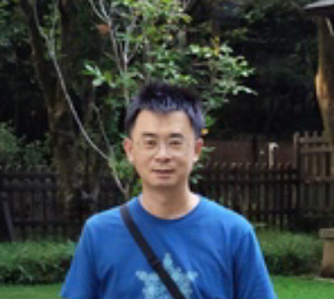

## 聯絡方式
- Line 帳號 @211wegrx
- IG 帳號 [taomuru](https://www.instagram.com/taomuru/)
- Threads 帳號 [@taomuru](https://www.threads.com/@taomuru)
- Youtube 頻道 https://www.youtube.com/@thaolaxd
## 服務方式
- 線上諮詢,可文字,語音或視訊(Line, Zoom, Google Meet, WeChat, Whatsapp, Telegram, Email)
- 提供Aura基礎解讀報告一份(可指定報告的語文,例如英文,中文,等等)
- 提供問題諮詢: 例如個人,家庭,情侶,工作職業,情緒心理,未來預測,靈性問題(額外收費)
- 不提供健康問題諮詢,不提供過世親人通靈
- 支援Paypal付款
- 需要提供一張全身照片, 並參考下方照片,注意人像比例跟姿勢, 頭頂上方空間佔據30%, 人佔據照片高度的20%, 腳底到最下方的空間佔據30%, 掌心向前, 背景最好是淡色的牆壁, 最好是短袖短褲

- Google評價 https://g.page/r/CQfz6lbreLYLEBM/review
## 關於我
- 畢業於中興大學應用數學系跟資訊科學研究所
- 曾經擔任多家公司主管及新創公司CEO

## 合作
- 歡迎療癒師,心理輔導諮商單位合作
- 公益活動歡迎洽詢
## 何謂Aura氣場
- Aura,氣場,人體能量場,輝光,暉光,靈氣
- 範圍涵蓋人體周圍電磁粒子
## Aura氣場起源
- 西元前500-700年,印度的奧義書有提到五層能量場,但是沒有提到光
- 西元前320年,葛洪(號抱朴子),第一次以文獻方式紀錄人體周圍的光環及光
## Aura氣場七層
- 第一層: 生理層(Physical),與身體健康有關,常見的克里安照相技術,kirlian,GDV都是在屬於這一層
- 第二層: 乙太層(Etheirc),共有雙層,第二層代表永恆的自己,這裡保存輪迴,記憶,潛意識,並在人體死亡時把靈魂載走. 而一般所謂的鬼魂,也就是看到這一層.
- 第三層: 活力/生命能量(Vital),不只吸收能量,也是唯一還會對外發射能量.
- 第四層: 星光體(Astral),橢圓型,也稱為光環蛋,與周遭能量互動
- 第五層: 心智內層(Lower mental),智力水平
- 第六層: 心智外層(Higher mental),連結宇宙智慧
- 第七層: 靈性(Spirtual),吸收宇宙能量供生命使用
## Aura氣場圖

